# Jungle Game - MVC Architecture Design

## Class Diagram

```mermaid
classDiagram
    %% ========================================
    %% MODEL PACKAGE - Game Logic Layer
    %% ========================================
    
    namespace Model {
        class Board {
            -Piece[][] grid
            -SquareType[][] terrain
            -int ROWS = 9
            -int COLS = 7
            -List~Tuple~ RED_TRAPS
            -List~Tuple~ BLUE_TRAPS
            -List~Tuple~ WATER_SQUARES
            -Tuple RED_DEN
            -Tuple BLUE_DEN
            +__init__()
            +setup_initial_position()
            +get_piece(row, col) Piece
            +set_piece(row, col, piece)
            +remove_piece(row, col) Piece
            +move_piece(from_row, from_col, to_row, to_col) Piece
            +get_terrain(row, col) SquareType
            +is_water(row, col) bool
            +is_trap(row, col, player) bool
            +is_den(row, col, player) bool
            +is_opponent_den(row, col, player) bool
            +get_all_pieces(player) List~Piece~
            +copy() Board
        }
        
        class SquareType {
            <<enumeration>>
            NORMAL
            TRAP
            DEN
            WATER
        }
        
        class Piece {
            <<abstract>>
            -PieceType piece_type
            -Player owner
            -int row
            -int col
            +__init__(piece_type, owner, row, col)
            +rank() int
            +get_symbol() str
            +get_name() str
            +can_swim() bool
            +can_jump() bool
            +to_dict() dict
            +from_dict(data)$ Piece
        }
        
        class PieceType {
            <<enumeration>>
            RAT = 1
            CAT = 2
            DOG = 3
            WOLF = 4
            LEOPARD = 5
            TIGER = 6
            LION = 7
            ELEPHANT = 8
        }
        
        class Player {
            <<enumeration>>
            RED
            BLUE
        }
        
        class Rat {
            +can_swim() bool
            +special_ability() "Can defeat Elephant, can enter water"
        }
        
        class Elephant {
            +special_weakness() "Defeated by Rat"
        }
        
        class Lion {
            +can_jump() bool
            +special_ability() "Can jump over river (3 squares)"
        }
        
        class Tiger {
            +can_jump() bool
            +special_ability() "Can jump over river (3 squares)"
        }
        
        class Cat {
            +rank() int
        }
        
        class Dog {
            +rank() int
        }
        
        class Wolf {
            +rank() int
        }
        
        class Leopard {
            +rank() int
        }
        
        class Move {
            -Piece piece
            -int from_row
            -int from_col
            -int to_row
            -int to_col
            -Piece captured
            -int move_number
            +__init__(piece, from_row, from_col, to_row, to_col, captured, move_number)
            +to_notation(board) str
            +to_dict() dict
            +from_dict(data)$ Move
        }
        
        class MoveValidator {
            -Board board
            +__init__(board)
            +is_valid_move(piece, to_row, to_col) Tuple~bool, str~
            +can_capture(attacker, attacker_pos, defender, defender_pos) Tuple~bool, str~
            +get_legal_moves(piece) List~Tuple~
            -_is_orthogonal(from_row, from_col, to_row, to_col) bool
            -_is_jump_move(from_row, from_col, to_row, to_col) bool
            -_validate_jump(from_row, from_col, to_row, to_col) Tuple~bool, str~
            -_get_jump_path_squares(from_row, from_col, to_row, to_col) List
            -_get_jump_targets(from_row, from_col) List
        }
        
        class GameState {
            -Board board
            -Player current_player
            -List~Move~ move_history
            -int move_count_no_capture
            -List~str~ position_history
            -str game_status
            -Dict captured_pieces
            -List~dict~ undo_stack
            -List~dict~ redo_stack
            -int MAX_UNDO_LEVELS = 10
            -int MAX_MOVES_WITHOUT_CAPTURE = 50
            +__init__()
            +start_new_game()
            +make_move(from_row, from_col, to_row, to_col) Tuple~bool, str~
            +undo() Tuple~bool, str~
            +redo() Tuple~bool, str~
            +save_to_file(filename) Tuple~bool, str~
            +load_from_file(filename) Tuple~bool, str~
            -_save_undo_state()
            -_restore_state(state)
            -_check_game_end(to_row, to_col)
            -_has_legal_moves(player) bool
            -_get_position_hash() str
            -_check_threefold_repetition() bool
            -_serialize_board() List
            -_deserialize_board(data)
        }
        
        class GameStatus {
            <<enumeration>>
            IN_PROGRESS
            RED_WIN
            BLUE_WIN
            DRAW
        }
    }
    
    %% ========================================
    %% VIEW PACKAGE - Presentation Layer
    %% ========================================
    
    namespace View {
        class CLIView {
            -Board board
            +__init__()
            +display_board(board, highlight_positions)
            +display_game_status(game_state)
            +display_move_history(game_state, last_n)
            +display_legal_moves(board, piece, legal_moves)
            +get_user_input(prompt) str
            +display_message(message)
            +display_error(error)
            +display_success(message)
            +display_menu()
            +display_game_over(game_status, game_state)
            +confirm_action(prompt) bool
            +display_replay_controls()
            +clear_screen()
        }
        
        class ReplayEngine {
            -List~Move~ moves
            -int current_index
            -float speed
            -bool is_playing
            -Board board
            +__init__(game_state)
            +reset()
            +step_forward() bool
            +step_backward() bool
            +goto_move(move_number) bool
            +play_auto(view, delay)
            +stop_playing()
            +set_speed(multiplier)
            +get_current_move() Move
            +get_progress() Tuple
        }
    }
    
    %% ========================================
    %% CONTROLLER PACKAGE - Coordination Layer
    %% ========================================
    
    namespace Controller {
        class GameController {
            -GameState game_state
            -CLIView view
            +__init__()
            +start()
            +game_loop()
            +handle_command(command)
            +handle_move(from_pos, to_pos)
            +handle_show_moves(pos)
            +handle_undo()
            +handle_redo()
            +handle_history()
            +handle_save(filename)
            +handle_load(filename)
            +handle_new_game()
            +handle_replay()
            +replay_mode()
        }
    }
    
    %% ========================================
    %% RELATIONSHIPS
    %% ========================================
    
    %% Inheritance (Piece hierarchy)
    Piece <|-- Rat : extends
    Piece <|-- Cat : extends
    Piece <|-- Dog : extends
    Piece <|-- Wolf : extends
    Piece <|-- Leopard : extends
    Piece <|-- Tiger : extends
    Piece <|-- Lion : extends
    Piece <|-- Elephant : extends
    
    %% Composition (Board contains Pieces)
    Board *-- "16" Piece : contains
    Board o-- SquareType : uses
    
    %% Association (Piece uses enums)
    Piece --> PieceType : has
    Piece --> Player : owned by
    
    %% Composition (Move contains Pieces)
    Move *-- "1..2" Piece : piece + captured
    
    %% Association (MoveValidator validates on Board)
    MoveValidator --> Board : validates on
    MoveValidator --> Piece : validates
    
    %% Composition (GameState contains Board and Moves)
    GameState *-- "1" Board : manages
    GameState *-- "*" Move : records
    GameState o-- GameStatus : has status
    GameState --> MoveValidator : uses
    
    %% Association (View displays Model)
    CLIView --> Board : displays
    CLIView --> GameState : reads from
    CLIView --> Piece : displays
    
    %% Composition (ReplayEngine uses Moves)
    ReplayEngine *-- "*" Move : replays
    ReplayEngine *-- "1" Board : reconstructs
    
    %% Association (Controller coordinates Model and View)
    GameController *-- "1" GameState : manages
    GameController *-- "1" CLIView : uses
    GameController --> ReplayEngine : creates
    GameController --> MoveValidator : uses
    
    %% Notes for special interactions
    note for Rat "Special: can_swim() returns True\nCan enter WATER squares\nCan defeat Elephant (rank 8)\nCannot be captured by land pieces when in water"
    
    note for Board "Tracks WATER_SQUARES:\nLeft River: A4-B6\nRight River: F4-G6\nRat interacts with water terrain"
    
    note for MoveValidator "Validates Rat-River interaction:\n1. Check if destination is WATER\n2. Only Rat can enter (can_swim())\n3. Rat in water protected from land pieces\n4. Validates Lion/Tiger jumps (blocked by Rat in path)"
```



---

## Detailed Architecture Explanation

### 1. **Model Package** (Pure Game Logic)

#### Core Classes:

**Board**
- **Responsibility**: Manages the 7×9 grid and terrain
- **Composition**: Contains 16 `Piece` objects (8 per player)
- **Key Fields**:
  - `grid[9][7]`: 2D array of Pieces
  - `terrain[9][7]`: 2D array of SquareTypes
  - `WATER_SQUARES`: List of water coordinates
- **Independence**: No dependency on View or Controller

**Piece (Abstract Base)**
- **Hierarchy**: 8 concrete subclasses (Rat, Cat, Dog, Wolf, Leopard, Tiger, Lion, Elephant)
- **Key Fields**:
  - `piece_type`: PieceType enum (determines rank 1-8)
  - `owner`: Player enum (RED/BLUE)
  - `row`, `col`: Current position
- **Polymorphism**: 
  - `can_swim()`: Overridden by Rat (returns True)
  - `can_jump()`: Overridden by Lion/Tiger (returns True)

**MoveValidator**
- **Responsibility**: Validates all move rules
- **Key Methods**:
  - `is_valid_move()`: Checks terrain, distance, orthogonality
  - `can_capture()`: Implements hierarchy and special rules
  - `_validate_jump()`: Lion/Tiger river jump validation

**GameState**
- **Responsibility**: Manages complete game state
- **Key Features**:
  - Undo/Redo stacks (10 levels)
  - Position history (threefold repetition detection)
  - Save/Load to JSON
  - Win/Draw condition checking

---

### 2. **View Package** (Presentation Layer)

**CLIView**
- **Responsibility**: Display and user input
- **Key Methods**:
  - `display_board()`: ASCII board rendering
  - `display_legal_moves()`: Highlight valid moves
  - `display_game_status()`: Show turn, move count
- **Dependency**: Reads from Model (Board, GameState) but never modifies

**ReplayEngine**
- **Responsibility**: Replay game history
- **Key Features**:
  - Step forward/backward through moves
  - Auto-play with speed control
  - Reconstruct board state at any move

---

### 3. **Controller Package** (Coordination Layer)

**GameController**
- **Responsibility**: Coordinate Model and View
- **Key Methods**:
  - `handle_move()`: Parse input → Call GameState.make_move()
  - `handle_show_moves()`: Get legal moves → Display via View
  - `handle_save/load()`: Coordinate file operations
  - `replay_mode()`: Create ReplayEngine → Coordinate playback
- **MVC Hub**: Only component that knows about both Model and View

---

## 3. Rat and River Interaction - Detailed Modeling

### 3.1 Data Model

```python
# In Board class
WATER_SQUARES = [
    (3, 0), (3, 1), (4, 0), (4, 1), (5, 0), (5, 1),  # Left river (A4-B6)
    (3, 5), (3, 6), (4, 5), (4, 6), (5, 5), (5, 6)   # Right river (F4-G6)
]

def is_water(self, row: int, col: int) -> bool:
    return self.get_terrain(row, col) == SquareType.WATER
```

### 3.2 Rat's Special Ability

```python
# In Piece class (overridden by Rat)
class Piece:
    def can_swim(self) -> bool:
        return False  # Default for all pieces

class Rat(Piece):
    def can_swim(self) -> bool:
        return True  # Only Rat can swim
```

### 3.3 Movement Validation

```python
# In MoveValidator class
def is_valid_move(self, piece: Piece, to_row: int, to_col: int) -> Tuple[bool, str]:
    # Terrain check
    if self.board.is_water(to_row, to_col):
        if not piece.can_swim():
            return False, "Cannot enter water"  # Blocks all except Rat
    
    # ... other validations
```

### 3.4 Capture Protection

```python
# In MoveValidator.can_capture()
def can_capture(self, attacker: Piece, attacker_row: int, attacker_col: int,
                defender: Piece, defender_row: int, defender_col: int) -> Tuple[bool, str]:
    
    # Rat in water protection
    if defender.piece_type == PieceType.RAT and self.board.is_water(defender_row, defender_col):
        if attacker.piece_type != PieceType.RAT:
            return False, "Only Rat can attack Rat in water"
    
    # Rat can defeat Elephant (special rule)
    if attacker.piece_type == PieceType.RAT and defender.piece_type == PieceType.ELEPHANT:
        return True, ""
    
    # Normal hierarchy
    return attacker.rank >= defender.rank, ""
```

### 3.5 Lion/Tiger Jump Blocking

```python
# In MoveValidator._validate_jump()
def _validate_jump(self, from_row: int, from_col: int, to_row: int, to_col: int) -> Tuple[bool, str]:
    water_squares = self._get_jump_path_squares(from_row, from_col, to_row, to_col)
    
    # Check if any Rat is in the water path
    for row, col in water_squares:
        piece = self.board.get_piece(row, col)
        if piece and piece.piece_type == PieceType.RAT:
            return False, "Jump blocked by Rat"  # Rat blocks Lion/Tiger jumps
    
    return True, ""
```

### 3.6 Interaction Flow Diagram

```
┌─────────────────────────────────────────────────┐
│ Rat-River Interaction Flow                      │
└─────────────────────────────────────────────────┘

1. MOVE ATTEMPT: Rat → Water Square
   ┌───────────────────────────────────┐
   │ MoveValidator.is_valid_move()     │
   │   → board.is_water(destination)?  │
   │   → piece.can_swim()?             │
   │   → ✓ Allowed (Rat only)          │
   └───────────────────────────────────┘

2. CAPTURE ATTEMPT: Land Piece → Rat in Water
   ┌───────────────────────────────────┐
   │ MoveValidator.can_capture()       │
   │   → defender.is_water()?          │
   │   → attacker is Rat?              │
   │   → ✗ Blocked (protection)        │
   └───────────────────────────────────┘

3. JUMP ATTEMPT: Lion/Tiger → Cross River
   ┌───────────────────────────────────┐
   │ MoveValidator._validate_jump()    │
   │   → Get water squares in path     │
   │   → Check each for Rat            │
   │   → ✗ Blocked if Rat present      │
   └───────────────────────────────────┘

4. RAT VS ELEPHANT: Special Rule
   ┌───────────────────────────────────┐
   │ MoveValidator.can_capture()       │
   │   → attacker == RAT?              │
   │   → defender == ELEPHANT?         │
   │   → ✓ Rat wins (rank 1 beats 8)  │
   └───────────────────────────────────┘
```

---

## 4. Key Design Patterns

### 4.1 **MVC Pattern**
- **Separation**: Model knows nothing about View/Controller
- **Independence**: View can be replaced (CLI → GUI) without changing Model
- **Coordination**: Controller is the only mediator

### 4.2 **Strategy Pattern**
- `Piece.can_swim()` and `Piece.can_jump()`: Polymorphic behavior
- Different pieces have different movement capabilities

### 4.3 **Command Pattern**
- `Move` class: Encapsulates move data
- Enables Undo/Redo via state restoration

### 4.4 **Memento Pattern**
- `GameState.undo_stack`: Stores previous states
- Supports reverting to earlier game positions

### 4.5 **Facade Pattern**
- `GameController`: Simplifies interaction between complex subsystems
- Hides Model/View complexity from user commands

---

## 5. Data Flow Example: "move E3 E4"

```
┌──────────────┐
│ User Input   │  "move E3 E4"
└──────┬───────┘
       │
       ▼
┌──────────────────────────────────────┐
│ Controller: GameController           │
│  handle_move("E3", "E4")             │
│   1. Parse notation → (2,4) → (3,4)  │
└──────┬───────────────────────────────┘
       │
       ▼
┌──────────────────────────────────────┐
│ Model: GameState                     │
│  make_move(2, 4, 3, 4)               │
│   1. Get piece at (2,4) → Rat        │
│   2. Validate via MoveValidator      │
└──────┬───────────────────────────────┘
       │
       ▼
┌──────────────────────────────────────┐
│ Model: MoveValidator                 │
│  is_valid_move(Rat, 3, 4)            │
│   1. Check distance (1 square) ✓     │
│   2. Check orthogonal ✓              │
│   3. Check terrain (water?) → Yes    │
│   4. Check can_swim() → Yes (Rat) ✓  │
└──────┬───────────────────────────────┘
       │ Valid = True
       ▼
┌──────────────────────────────────────┐
│ Model: Board                         │
│  move_piece(2, 4, 3, 4)              │
│   1. Remove Rat from (2,4)           │
│   2. Place Rat at (3,4) [water]      │
└──────┬───────────────────────────────┘
       │
       ▼
┌──────────────────────────────────────┐
│ Model: GameState                     │
│   1. Record Move in move_history     │
│   2. Save state to undo_stack        │
│   3. Switch current_player           │
└──────┬───────────────────────────────┘
       │ Success = True
       ▼
┌──────────────────────────────────────┐
│ Controller: GameController           │
│   Return success to user             │
└──────┬───────────────────────────────┘
       │
       ▼
┌──────────────────────────────────────┐
│ View: CLIView                        │
│  display_board(game_state.board)     │
│   → Show Rat now at E4 (water)       │
└──────────────────────────────────────┘
```

---

## 6. Extension Points

### 6.1 Adding GUI View
```python
class GUIView:  # Parallel to CLIView
    def display_board(self, board):
        # Use tkinter to draw graphical board
        pass
    
# In GameController
self.view = GUIView()  # Change this line only
```

### 6.2 Adding AI Player
```python
class AIController(GameController):
    def get_ai_move(self, game_state) -> Tuple[int, int, int, int]:
        # Implement minimax or MCTS
        pass
```

### 6.3 Network Multiplayer
```python
class NetworkGameState(GameState):
    def make_move(self, ...):
        super().make_move(...)
        self.send_to_server(move)  # Sync with remote player
```

---

## Summary

### ✅ **Model Package**
- `Board`: Manages grid and terrain (including WATER squares)
- `Piece` hierarchy: 8 subclasses with polymorphic abilities
- `Rat`: Overrides `can_swim()` to enable water entry
- `MoveValidator`: Enforces all rules including Rat-River interaction
- `GameState`: Complete game management with undo/save/replay

### ✅ **View Package**
- `CLIView`: ASCII display with no game logic
- `ReplayEngine`: Reconstruct and display game history

### ✅ **Controller Package**
- `GameController`: Coordinates Model ↔ View
- Handles all user commands
- Creates and manages ReplayEngine

### ✅ **Rat-River Interaction**
1. **Data Model**: `Board.WATER_SQUARES` defines river locations
2. **Ability Model**: `Rat.can_swim()` returns True (polymorphism)
3. **Movement Validation**: `MoveValidator` checks terrain vs ability
4. **Capture Protection**: Rat in water immune to land pieces
5. **Jump Blocking**: Rat in water blocks Lion/Tiger jumps
6. **Special Rule**: Rat defeats Elephant regardless of location

This architecture strictly follows MVC principles with clear separation of concerns and supports all game features including the special Rat-River interactions.
