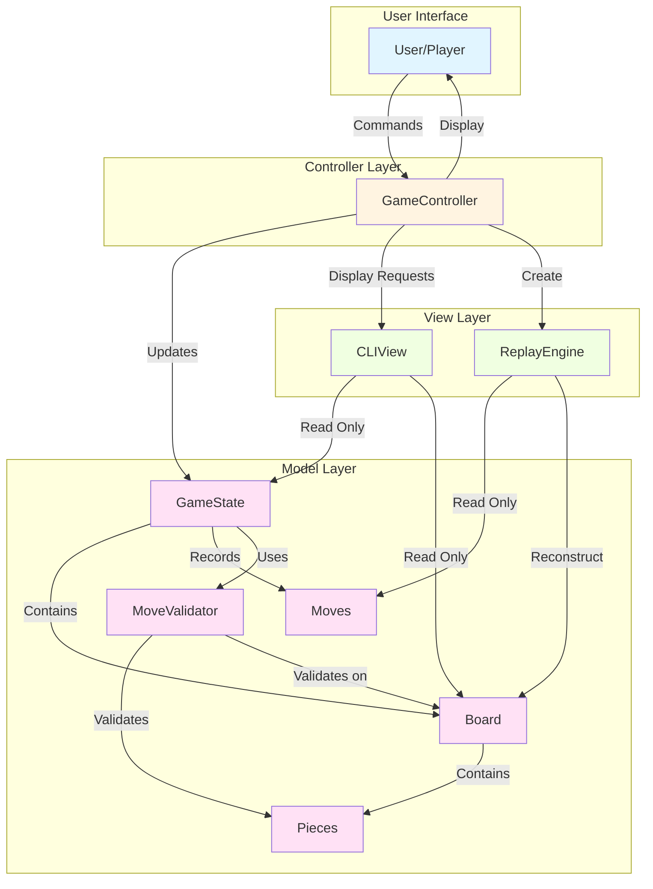
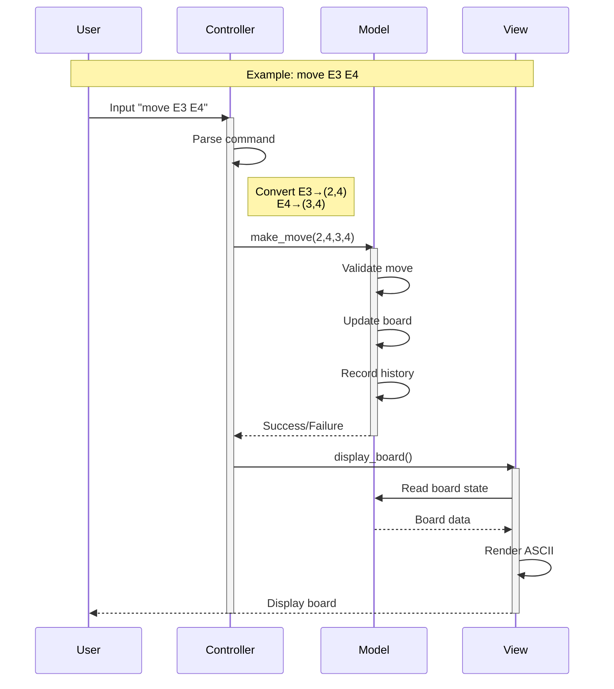
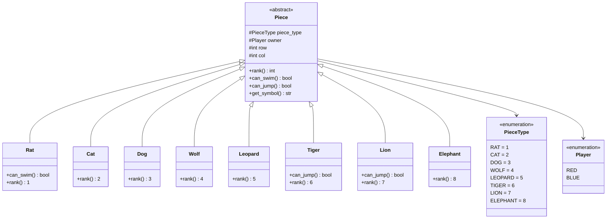
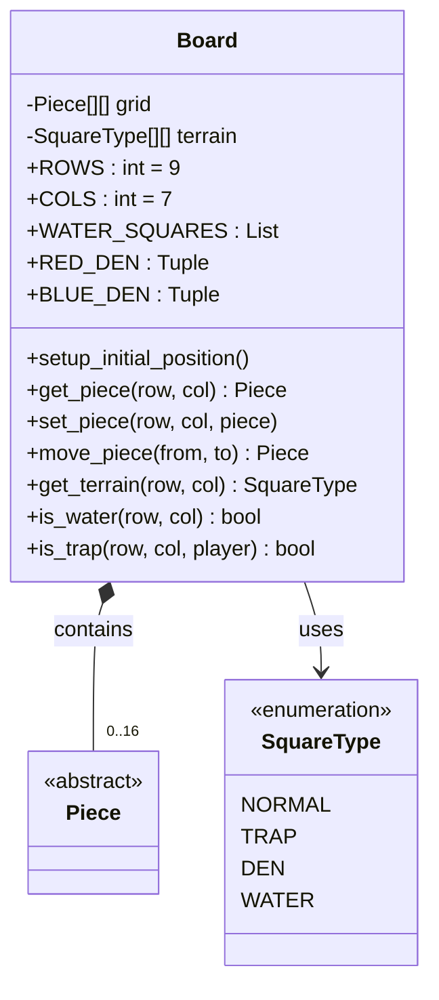
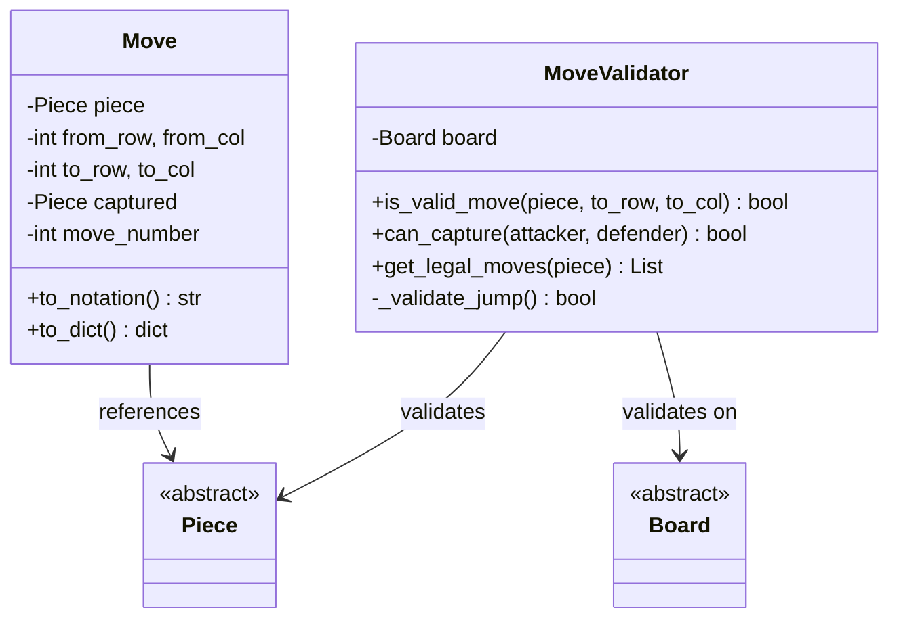
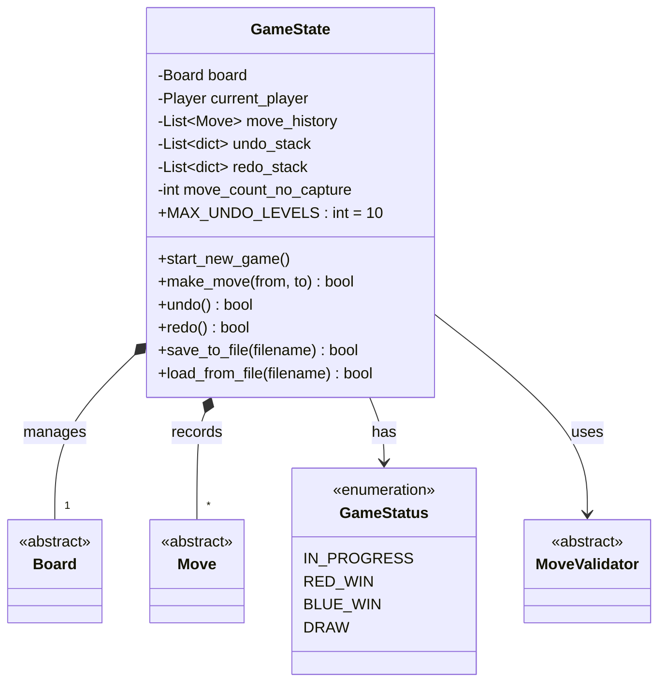
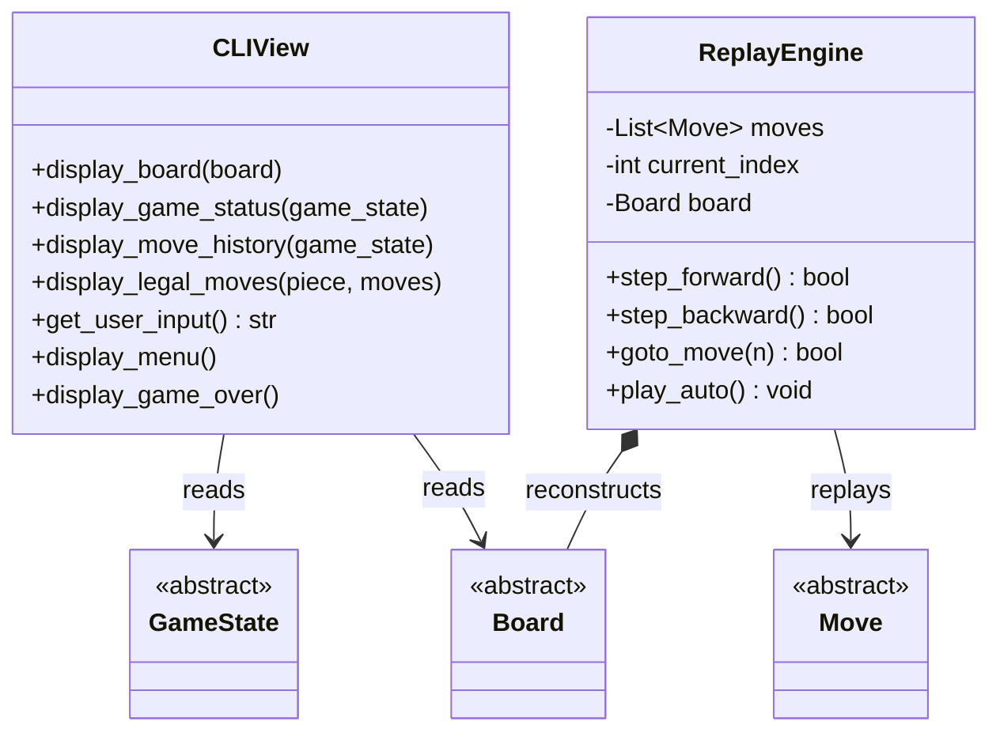
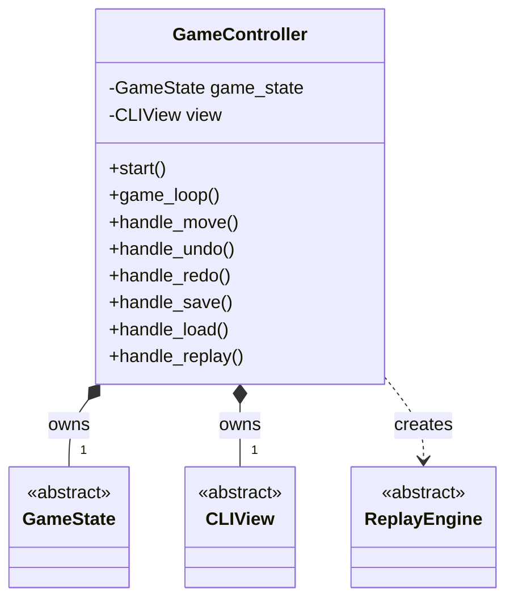
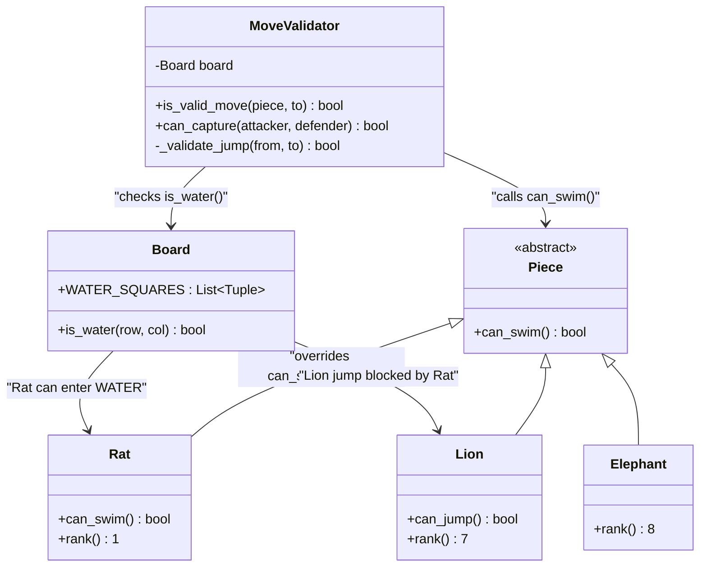
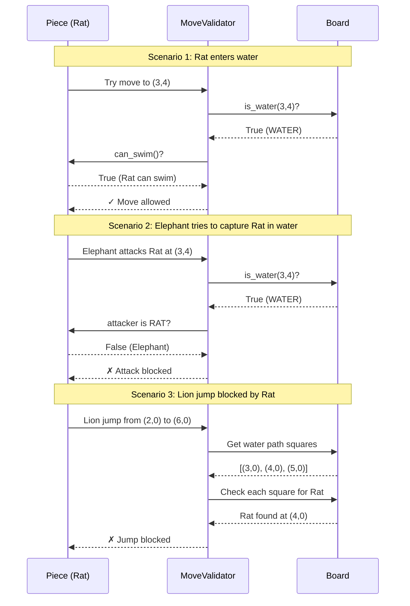

# Jungle Game - MVC Architecture Design

## 1. MVC Architecture Overview

### 1.1 High-Level MVC Structure



### 1.2 MVC Separation Principles

#### **Model (Pink) - Pure Game Logic**
- **Independence**: No knowledge of View or Controller
- **Responsibility**: Game rules, state management, validation
- **Components**: 
  - `GameState`: Master game manager
  - `Board`: Grid and terrain management
  - `Pieces`: 8 types with behaviors
  - `MoveValidator`: Rule enforcement
  - `Move`: Move records

#### **View (Green) - Presentation Only**
- **Independence**: Only reads Model, never modifies
- **Responsibility**: Display information to user
- **Components**:
  - `CLIView`: ASCII board rendering, messages
  - `ReplayEngine`: Historical game playback

#### **Controller (Yellow) - Coordinator**
- **Responsibility**: Mediate between Model and View
- **Only component** that knows both Model and View
- **Components**:
  - `GameController`: Parse commands, coordinate actions

### 1.3 Interaction Flow



---

## 2. Detailed Class Diagrams

### 2.1 Model Package - Core Classes



### 2.2 Model Package - Board and Terrain



### 2.3 Model Package - Move and Validation



### 2.4 Model Package - GameState



### 2.5 View Package



### 2.6 Controller Package



---

## 3. Rat-River 交互建模详解

### 3.1 核心设计思路

**问题**：如何实现"只有鼠能游泳"和"水中的鼠不能被陆地棋子吃掉"？

**解决方案**：通过**多态 + 地形检测**实现

### 3.2 类图：Rat-River 交互



### 3.3 实现细节

#### **步骤 1：定义水域位置（Board 类）**
```python
class Board:
    WATER_SQUARES = [
        (3, 0), (3, 1), (4, 0), (4, 1), (5, 0), (5, 1),  # 左河 A4-B6
        (3, 5), (3, 6), (4, 5), (4, 6), (5, 5), (5, 6)   # 右河 F4-G6
    ]
    
    def is_water(self, row, col) -> bool:
        return (row, col) in self.WATER_SQUARES
```

#### **步骤 2：定义游泳能力（Piece 多态）**
```python
class Piece:  # 抽象基类
    def can_swim(self) -> bool:
        return False  # 默认：不能游泳

class Rat(Piece):  # 鼠 - 重写方法
    def can_swim(self) -> bool:
        return True  # 只有鼠能游泳
```

#### **步骤 3：移动验证（MoveValidator）**
```python
class MoveValidator:
    def is_valid_move(self, piece, to_row, to_col):
        # 检查目标是否为水域
        if self.board.is_water(to_row, to_col):
            # 调用多态方法检查能力
            if not piece.can_swim():
                return False, "Cannot enter water"
        
        return True, ""
```

#### **步骤 4：水中鼠的保护（MoveValidator）**
```python
def can_capture(self, attacker, attacker_pos, defender, defender_pos):
    # 如果防守方是在水中的鼠
    if (defender.piece_type == PieceType.RAT and 
        self.board.is_water(defender_pos[0], defender_pos[1])):
        # 只有鼠能攻击水中的鼠
        if attacker.piece_type != PieceType.RAT:
            return False, "Only Rat can attack Rat in water"
    
    # 鼠吃象特殊规则
    if attacker.piece_type == PieceType.RAT and defender.piece_type == PieceType.ELEPHANT:
        return True, ""
    
    # 普通等级规则
    return attacker.rank >= defender.rank
```

#### **步骤 5：跳河阻挡（MoveValidator）**
```python
def _validate_jump(self, from_row, from_col, to_row, to_col):
    # 获取跳跃路径上的3个水域格子
    water_path = self._get_jump_path_squares(from_row, from_col, to_row, to_col)
    
    # 检查路径中是否有鼠
    for row, col in water_path:
        piece = self.board.get_piece(row, col)
        if piece and piece.piece_type == PieceType.RAT:
            return False, "Jump blocked by Rat in water"
    
    return True, ""
```

### 3.4 交互流程图



---

## 4. 架构优势

### 4.1 **Model Package** (纯游戏逻辑)

- **Board**: 管理 7×9 棋盘和地形，包含16个棋子
- **Piece 继承体系**: 8个具体类（鼠、猫、狗、狼、豹、虎、狮、象）
  - 多态方法：`can_swim()`（鼠重写为True）、`can_jump()`（狮虎重写为True）
- **MoveValidator**: 验证所有游戏规则（地形、距离、吃子、跳河）
- **GameState**: 管理游戏状态、撤销/重做、存档/读档、胜负判定

**独立性**：Model 层不依赖 View 或 Controller，可独立测试

### 4.2 **View Package** (展示层)

- **CLIView**: ASCII 棋盘显示，从 Model 读取但不修改
- **ReplayEngine**: 回放历史棋局，可前进/后退/自动播放

**单向依赖**：View 只读取 Model，不调用 Model 的修改方法

### 4.3 **Controller Package** (协调层)

- **GameController**: MVC 的中枢，唯一同时了解 Model 和 View 的组件
  - 解析用户输入 → 调用 Model 方法
  - 获取 Model 状态 → 调用 View 显示
  - 创建和管理 ReplayEngine

**中介作用**：Model 和 View 之间的所有交互都通过 Controller

### 4.4 **MVC 严格分离的好处**

| 层级 | 职责 | 依赖关系 | 可替换性 |
|------|------|----------|----------|
| Model | 游戏逻辑 | 零依赖 | ✓ 可复用于 GUI |
| View | 界面显示 | 依赖 Model（只读） | ✓ 可替换为 tkinter GUI |
| Controller | 协调 | 依赖 Model + View | ✓ 可扩展为 AI 对手 |

---

## 5. 核心设计模式

### 5.1 **MVC Pattern** (Model-View-Controller)
- **分离关注点**: Model 不知道 View 存在
- **可替换性**: CLI → GUI 只需修改 Controller 的 View 引用

### 5.2 **Strategy Pattern** (策略模式)
- `Piece.can_swim()` / `can_jump()`: 不同棋子有不同能力
- 通过多态避免 `if-elif` 判断棋子类型

### 5.3 **Command Pattern** (命令模式)
- `Move` 类封装走棋操作
- 支持撤销（保存移动前状态）、重做

### 5.4 **Memento Pattern** (备忘录模式)
- `GameState.undo_stack`: 保存历史状态
- 支持恢复到任意历史位置

### 5.5 **Facade Pattern** (外观模式)
- `GameController` 简化 Model/View 的复杂交互
- 用户只需输入命令，无需了解内部实现

---

## 6. 数据流示例："move E3 E4"

```
用户输入 "move E3 E4"
    ↓
GameController.handle_move("E3", "E4")
    ↓ 解析坐标 (2,4) → (3,4)
GameState.make_move(2, 4, 3, 4)
    ↓ 获取棋子 → Rat
MoveValidator.is_valid_move(Rat, 3, 4)
    ↓ 检查距离、方向、地形
    ↓ board.is_water(3,4)? → True
    ↓ Rat.can_swim()? → True ✓
Board.move_piece(2, 4, 3, 4)
    ↓ 移动鼠到水域
GameState 记录移动、保存状态、切换玩家
    ↓
Controller 返回成功
    ↓
CLIView.display_board() 显示更新后的棋盘
```

---

###### 8. 总结

### ✅ **MVC 架构优势**
- **Model**: 纯逻辑，零 UI 依赖，可复用
- **View**: 纯展示，可替换（CLI/GUI/Web）
- **Controller**: 中介协调，易扩展（AI/网络）

### ✅ **Rat-River 交互建模**
1. **Board**: 定义 `WATER_SQUARES` 位置
2. **Rat**: 重写 `can_swim()=True`（多态）
3. **MoveValidator**: 检查 `board.is_water()` + `piece.can_swim()`
4. **保护机制**: 水中鼠免疫陆地棋子攻击
5. **跳河阻挡**: 鼠阻挡狮虎跳河
6. **特殊规则**: 鼠吃象（不论位置）

### ✅ **代码质量**
- **可测试**: Model 层可独立单元测试
- **可维护**: 清晰的职责划分
- **可扩展**: 支持新棋子类型、新 View、新功能

该架构严格遵守 MVC 原则，通过多态和地形检测优雅实现了鼠-河交互的所有规则。
