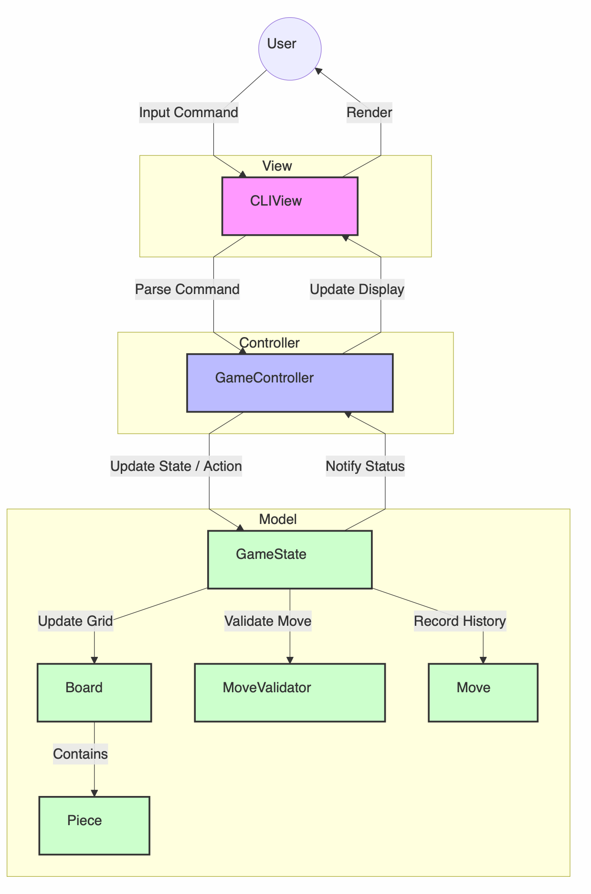
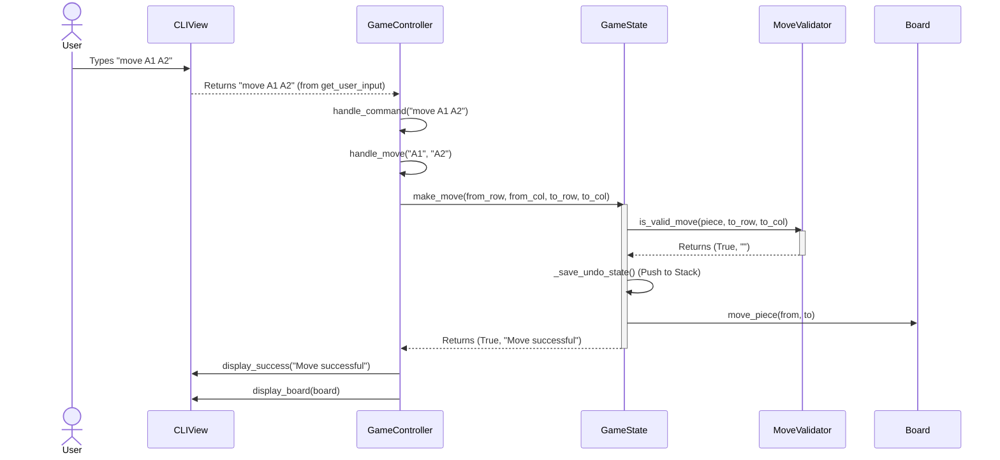

# Design_Document_Draft

##  a.Architecture

We have adopted the **Model-View-Controller (MVC)** design pattern for the Jungle Game application. This architectural choice was driven by three key software engineering principles:

1.  **Separation of Concerns**: The distinct separation between the game logic (Model), the user interface (View), and the interaction flow (Controller) ensures that each component has a single, well-defined responsibility.
2.  **Modularity**: Changes to one part of the system do not necessitate changes in others. For example, we could replace the CLI View with a Graphical User Interface (GUI) without modifying the core game logic.
3.  **Testability**: The Model can be tested completely independently of the View. This allows for robust unit testing of game rules, movement validity, and state transitions without needing to simulate user input or parse console output.

### Component Interaction

*   **Model** (`model/`): This layer acts as the source of truth. It stores the `Board`, `Piece` objects, and the current `GameState`. It encapsulates all game rules and logic (e.g., valid moves, capturing rules). Crucially, the Model is **completely unaware** of the View or Controller; it simply manages data and state.
*   **View** (`view/`): The View handles all interaction with the user via the Command Line Interface (CLI). It displays the board state to the console and captures user input. It **receives the current board state from the Controller** to render the current state but performs no game logic itself.
*   **Controller** (`controller/`): The Controller serves as the orchestrator. It manages the game loop, accepts input from the View, interprets that input into actions (like moving a piece), and updates the Model accordingly.

### Support for Advanced Features

This MVC structure is instrumental in supporting complex features such as **Undo (US6)** and **Save/Load (US9)**. By isolating the game state within the Model, we can easily serialize the `GameState` for saving/loading or maintain a history stack of states to implement the undo functionality, all without interference from the display logic.

## b Structure and Relationship of Main Code Components

This section details the core classes that drive the Jungle Game, specifically focusing on the Model and Controller layers as per the architecture defined above.

### Piece (Model)

The `Piece` class is an abstract base class representing a generic game piece. It utilizes the **Factory Method** pattern for instantiation and polymorphism for movement capabilities. Specific animal types (Rat, Lion, etc.) are implemented as subclasses.

**Purpose**: Encapsulates the properties (rank, owner, position) and intrinsic behaviors (swimming, jumping) of a game piece.

**Key Fields**:
*   `owner`: `Player` (Enum: RED or BLUE) - The owner of the piece.
*   `row`: `int` - Current row position on the board.
*   `col`: `int` - Current column position on the board.

**Key Public Methods**:

*   `Method: create(PieceType piece_type, Player owner, int row, int col) -> Piece`
    *   **Description**: Static factory method that creates and returns an instance of a specific `Piece` subclass based on the provided type.
    *   **Exceptions**: `ValueError` if an unknown piece type is provided.

*   `Method: can_swim() -> bool`
    *   **Description**: Returns whether the piece is capable of entering water squares. Overridden by the `Rat` subclass to return `True`; returns `False` by default.
    *   **Exceptions**: None.

*   `Method: can_jump() -> bool`
    *   **Description**: Returns whether the piece can jump over water regions. Overridden by `Tiger` and `Lion` subclasses to return `True`; returns `False` by default.
    *   **Exceptions**: None.

*   `Method: rank() -> int`
    *   **Description**: Property that returns the power rank (1-8) of the piece, derived from its `PieceType`.
    *   **Exceptions**: None.

### Board (Model)

The `Board` class represents the physical grid of the game (refer to `@UML/Model_Board.png` for visual structure). It manages the placement of pieces and the immutable terrain (Rivers, Traps, Dens).

**Purpose**: Manages the 7x9 grid state, validates coordinates, and handles low-level piece placement and removal.

**Key Fields**:
*   `grid`: `List[List[Optional[Piece]]]` - A 7x9 2D list storing `Piece` references or `None`.
*   `terrain`: `List[List[SquareType]]` - A 7x9 2D list storing terrain types (NORMAL, WATER, TRAP, DEN).

**Key Public Methods**:

*   `Method: move_piece(int from_row, int from_col, int to_row, int to_col) -> Optional[Piece]`
    *   **Description**: Moves a piece from the source coordinate to the destination coordinate in the grid. Returns the captured piece if the destination was occupied, otherwise `None`.
    *   **Exceptions**: None (Assumes validation is done prior).

*   `Method: get_piece(int row, int col) -> Optional[Piece]`
    *   **Description**: Retrieves the piece located at the specified coordinates.
    *   **Exceptions**: None.

*   `Method: is_trap(int row, int col, Player player) -> bool`
    *   **Description**: Checks if a specific square is an opponent's trap relative to the provided player.
    *   **Exceptions**: None.

### GameController (Controller)

The `GameController` orchestrates the application flow. It serves as the bridge that translates raw user input from the `CLIView` into semantic actions on the `GameState`.

**Purpose**: Runs the main game loop, parses text commands, and triggers model updates or view refreshes.

**Key Fields**:
*   `game_state`: `GameState` - The root object of the model layer.
*   `view`: `CLIView` - The interface for user interaction.

**Key Public Methods**:

*   `Method: start() -> None`
    *   **Description**: Initializes the game environment and begins the main game loop.
    *   **Exceptions**: None.

*   `Method: handle_command(str command) -> None`
    *   **Description**: Parses a raw command string (e.g., "move E3 E4", "undo", "save game1") and dispatches it to the appropriate handler method (e.g., `handle_move`, `handle_undo`).
    *   **Exceptions**: None (Internally catches `ValueError` and `IndexError` for invalid inputs, displaying error messages to the user instead of crashing).

### MoveValidator (Model)

The `MoveValidator` class implements the complex rules of the Jungle Game, decoupling rule validation from the `GameState` and `Board`. This strictly adheres to the **Single Responsibility Principle**.

**Purpose**: Validates whether a proposed move is legal according to all game rules, including movement patterns, jumping mechanics, terrain restrictions, and capture hierarchy.

**Key Public Methods**:

*   `Method: is_valid_move(Piece piece, int to_row, int to_col) -> Tuple[bool, str]`
    *   **Description**: Comprehensive validation check. It verifies:
        1.  **Bounds**: Destination is on board.
        2.  **Movement**: Distance is 1 (or valid jump for Tiger/Lion).
        3.  **Terrain**: Pieces (except Rat) cannot enter water; Own den is restricted.
        4.  **Jump Rules**: Checks if Lion/Tiger can jump over the river and if the path is blocked by a Rat.
        5.  **Capture Rules**: Checks rank hierarchy (e.g., Rat > Elephant, but Elephant !> Rat), Trap effects (rank becomes 0), and prevents friendly fire.
    *   **Exceptions**: None (Returns a tuple of `(is_valid, error_message)` for robust error handling without breaking control flow).

*   `Method: get_legal_moves(Piece piece) -> List[Tuple[int, int]]`
    *   **Description**: Returns a list of all valid destination coordinates for a given piece. Useful for AI or UI highlighting.
    *   **Exceptions**: None.

### GameState (Model)

The `GameState` class (referred to generally as the Game Model) encapsulates the entire state of a running game session. It acts as the Facade for the Model layer.

**Purpose**: Manages high-level game logic including turn management, history tracking for **Undo** (US6) and serialization for **Save/Load** (US9).

**Key Fields**:
*   `board`: `Board` - The current game board.
*   `current_player`: `Player` - Tracks whose turn it is.
*   `undo_stack`: `List[dict]` - A LIFO stack storing deep snapshots of previous game states. Each snapshot includes:
    *   Serialized Board (piece positions and types)
    *   Current Player
    *   Move counts (for 50-move rule)
    *   Captured pieces lists
*   `move_history`: `List[Move]` - A complete list of moves performed in the game for record-keeping and replay.

**Key Public Methods**:

*   `Method: make_move(int from_row, int from_col, int to_row, int to_col) -> Tuple[bool, str]`
    *   **Description**: Validates and executes a move. It delegates validation to `MoveValidator`. If valid, it saves the current state to the `undo_stack`, updates the board, handles captures, and switches the turn.
    *   **Exceptions**: None (Returns success boolean and message string).

*   `Method: undo() -> Tuple[bool, str]`
    *   **Description**: Reverts the game to the previous state by popping the last snapshot from the `undo_stack` and restoring the board and player variables.
    *   **Exceptions**: None (Returns failure status if stack is empty).

*   `Method: save_to_file(str filename) -> Tuple[bool, str]`
    *   **Description**: Serializes the current `GameState` (including board, history, and captured pieces) into a dictionary and writes it to a JSON file.
    *   **Exceptions**: Catches `IOError` or `OSError` during file writing and returns failure status.

*   `Method: load_from_file(str filename) -> Tuple[bool, str]`
    *   **Description**: Reads a JSON file, deserializes the data, and reconstructs the `GameState` object, effectively restoring a saved game.
    *   **Exceptions**: Catches `FileNotFoundError` or `JSONDecodeError` and returns failure status.

## c Example Use

The following sequence diagram illustrates the flow of execution for a typical user move command (e.g., `move A1 A2`).

## d Textual Explanations

The sequence diagram above depicts the collaboration between objects when a user attempts to move a piece:

1.  **User Interaction**: The user enters a command (e.g., `move A1 A2`) into the CLI.
2.  **Input Parsing**: The `CLIView` captures this input and passes it to the `GameController`. The Controller's `handle_command` method parses the string, identifying the action as a move and extracting the coordinates.
3.  **Model Invocation**: The Controller calls `game_state.make_move()`, translating algebraic notation (like 'A1') into grid coordinates (row/col indices) via the Board's helper methods.
4.  **Validation**: Inside the Model, `GameState` instantiates a `MoveValidator` to verify the move's legality. This checks for turn order, terrain restrictions (e.g., river), and capture rules.
5.  **State Update**: Upon successful validation:
    *   The current state (snapshot) is pushed onto the `undo_stack` for potential future rollback.
    *   The `Board` updates the piece's position using `move_piece()`.
    *   The `GameState` updates history, checks for win conditions, and switches the turn.
6.  **Feedback**: The Model returns a success message to the Controller.
7.  **View Refresh**: The Controller instructs the `CLIView` to display the success message and re-render the board with the new state, waiting for the next user input.
